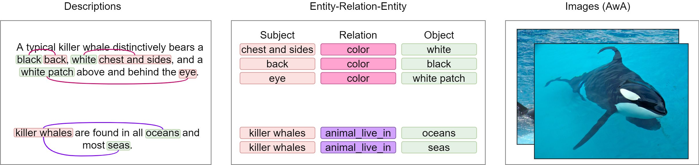

# Attribute Description Dataset of Animal(ADDA)

## Animal Feature Relation Data

The animal list of this data is based on [Animals with Attributes 2](https://cvml.ist.ac.at/AwA2/).
We collected animal feature explanations by googling.

We call this data as "animal **relation** data" because we are considering the relations of words in the sentence that explains animal.

## animal relation data distribute of the data
- Animal Number : 50 (which is the same as number of animals in **AWA** data)
- Relation Number : 48
- Category Number : 4

## What is Category?
We split explanations of animals into 4 categories(appearance, habitat, diet, characteristic).
These categories are a large classification of the feature found in animal images.
*additionally, category **characteristic** is for the features that cannot be included in any other categories*

## Overview


# Detailed Explanation of Data
## subj and obj types
subj count: 39
obj count: 37

You can check the detailed list of subj and obj type in **subj_obj_type.json**
There is special subj type named **KEY_SUBJ**, which means the subj is not in the sentence, but you can find it in **key value** of the sentence. 
for example,
```json
	"otter":[
        {
            "sentence": [
                "small",
                "mammals",
                "may",
                "also",
                "be",
                "eaten",
                "."
            ],
            "relation": [
                {
                    "category": "diet",
                    "subj_st": -1,
                    "subj_end": -1,
                    "subj_type": "KEY_SUBJ",
                    "obj_st": 0,
                    "obj_end": 1,
                    "obj_type": "food",
                    "rel_type": "animal_feed"
                }
            ]
        }
    ]
```
in this sentence, there is no word that indicate animal **otter**. So we chose subj_type as **KEY_SUBJ** and express word idx(subj_st, subj_end) as -1.

## Relations which include less than 7 animals.
> "stride_is": 1,
    "animal_love": 1,
    "wing_is": 1,
    "bigger_than": 1,
    "larger_than": 1,
    "smaller_than": 1,
    "chest_is": 1,
    "shoulder_is": 1,
    "baleen_is": 2,
    "group_is": 2,
    "longer_than": 2,
    "finger_is": 2,
    "flipper_is": 4,
    "color_is": 5,
    "hump_is": 6,
    "claw_is": 6,
    "hand_is": 7

### To consider all relations in training, I think it would be better to include the following animals in the study. 
> 22 animals 
> ['antelope', 'hippopotamus', 'bat', 'rat', 'buffalo', 'mouse', 'collie', 'blue+whale', 'chimpanzee', 'giraffe', 'giant+panda', 'raccoon', 'walrus', 'dolphin', 'fox', 'bobcat', 'grizzly+bear', 'moose', 'skunk', 'otter', 'mole', 'seal']
### But you can change anyway.
